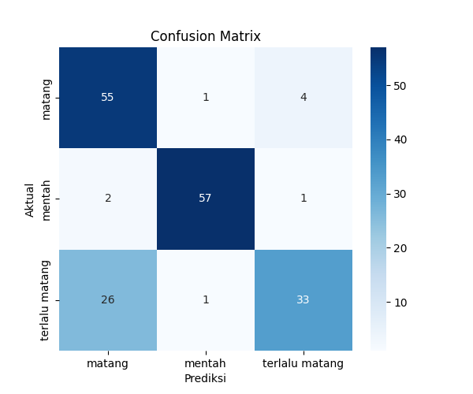

# 🍎 Deteksi Kematangan Buah Menggunakan HSI

## 📋 Deskripsi Proyek
Proyek ini bertujuan untuk mendeteksi tingkat kematangan buah secara otomatis menggunakan ekstraksi fitur warna berbasis ruang warna **HSI (Hue, Saturation, Intensity)** dan algoritma *Machine Learning* (Random Forest). Sistem ini dapat menganalisis gambar berbagai jenis buah (seperti Apel, Pisang, Jeruk, Mangga, Tomat) dan mengklasifikasikannya ke dalam tiga kategori: Mentah, Matang, atau Terlalu Matang/Busuk.

## 🎯 Problem Statement
Dalam industri pertanian dan distribusi pangan, pengecekan tingkat kematangan buah secara manual memakan waktu, rentan terhadap subjektivitas manusia, dan kurang efisien untuk skala besar. Sistem ini memberikan solusi *Computer Vision* yang konsisten, cepat, dan stabil terhadap variasi pencahayaan dibandingkan metode evaluasi visual biasa.

## ✨ Fitur Utama
- **Robust Background Removal**: Segmentasi cerdas menggunakan *Otsu's Thresholding* dan *Bounding Box Crop* otomatis, sehingga buah dapat dipisahkan dari *background* dengan sempurna (mencegah buah berlubang akibat pantulan kilap cahaya).
- **Ekstraksi Fitur HSI**: Mengubah gambar RGB menjadi ruang warna HSI yang sangat menyerupai persepsi mata manusia, memfilter *background* dan murni mengekstrak statistik (Mean & Std Dev) dari area buah.
- **Prediksi Kematangan Cepat**: Menggunakan model Random Forest yang akurat untuk prediksi langsung.
- **Dashboard Web Interaktif**: Menggunakan Streamlit sehingga pengguna dapat mengunggah gambar dan langsung melihat hasilnya secara visual.
- **Command Line Interface (CLI)**: Mendukung prediksi gambar langsung melalui terminal, **lengkap dengan visualisasi *Bounding Box* hijau** yang menandai letak buah di gambar beserta teks prediksinya.

## 🏗️ Arsitektur Sistem
1. **Input**: Gambar RGB buah yang diunggah pengguna.
2. **Preprocessing**: Gambar di-*blur* (Gaussian Filter) untuk mengurangi *noise*, lalu dikenakan proses Otsu's Masking dan pemotongan *Bounding Box* agar buah terfokus utuh sebelum di-*resize*.
3. **Ekstraksi Fitur**: Konversi ke ruang warna HSI dan ekstraksi nilai statistik cerdas (hanya memperhitungkan piksel buah valid).
4. **Machine Learning Model**: Fitur dimasukkan ke dalam model klasifikasi Random Forest yang sudah dilatih.
5. **Output**: Sistem menampilkan label kematangan (Mentah / Matang / Terlalu Matang) di terminal atau Web, beserta popup visualisasi deteksi.

## 🛠️ Tech Stack
- **Bahasa Pemrograman**: Python 3
- **Computer Vision**: OpenCV (`cv2`)
- **Machine Learning**: Scikit-Learn
- **Data Manipulation**: Pandas, NumPy
- **Visualisasi**: Matplotlib, Seaborn
- **Web Dashboard**: Streamlit

## 📸 Screenshot Aplikasi
*(Anda dapat menambahkan screenshot dashboard Streamlit di sini)*
 *(Ini adalah gambar Confusion Matrix sebagai placeholder. Ganti dengan screenshot web jika sudah ada)*

## 📁 Struktur Proyek
```text
Fruit-Ripeness-HSI/
├── data/
│   ├── raw/                 # Dataset asli (gambar buah)
│   └── processed/           # Fitur HSI dalam bentuk file CSV
├── models/
│   └── random_forest.pkl    # Model Machine Learning hasil pelatihan
├── notebooks/
│   ├── 01_EDA.ipynb         # Eksplorasi Data
│   └── 02_Preprocessing_and_Extraction.ipynb # Script ekstraksi fitur
├── reports/
│   ├── confusion_matrix.png # Grafik evaluasi model
│   └── feature_importance.png
├── src/
│   ├── image_utils.py       # Helper preprocessing gambar
│   └── feature_extraction.py# Helper konversi RGB ke HSI
├── app.py                   # Dashboard Web Streamlit
├── predict.py               # Script CLI Prediksi
├── train_model.py           # Script Pelatihan Model
└── requirements.txt         # Daftar dependencies/library
```

## 🚀 Instalasi
Ikuti langkah-langkah berikut untuk menjalankan proyek ini di mesin lokal Anda:

1. Pastikan Anda memiliki Python 3 terinstal.
2. Buat Virtual Environment dan aktifkan:
   ```bash
   python -m venv venv
   .\venv\Scripts\activate
   ```
3. Install seluruh library yang dibutuhkan:
   ```bash
   pip install -r requirements.txt
   ```
4. Jalankan aplikasi web (Streamlit):
   ```bash
   streamlit run app.py
   ```


## 🧪 Testing
- Pengujian model (*Model Evaluation*) dapat dilihat melalui metrik akurasi, *Precision*, *Recall*, dan grafik *Confusion Matrix* yang tersimpan di dalam direktori `reports/`.

## 👥 Tim Pengembang
- **Haidar** - *Machine Learning & Computer Vision*

## 📄 License
- MIT License - Silakan gunakan dan modifikasi proyek ini untuk keperluan riset dan edukasi.
